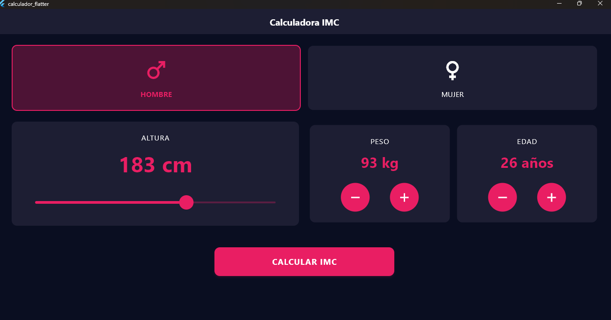
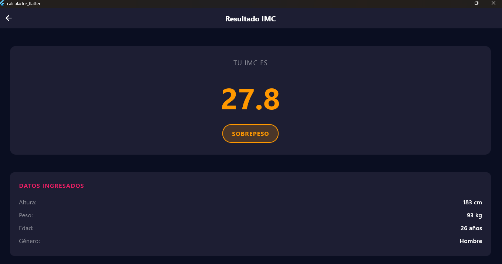

# Calculadora IMC - Flutter
---
## 📸 Vista previa

### 🎬 Demo en video

Ingresa para que se te descague, y lo puedas ver.

### 📱 Screenshots



---

## 🚀 Inicio rápido

### Requisitos previos
- [Flutter SDK](https://flutter.dev/docs/get-started/install) (v3.0+)
- Editor: VS Code o Android Studio

### Instalación y ejecución
1. **Clonar e instalar dependencias**:
   ```bash
   git clone <tu-repositorio>
   cd calculador_flutter
   flutter pub get
   ```

2. **Ejecutar la aplicación**:
   ```bash
   flutter run
   ```

3. **Generar APK** (opcional):
   ```bash
   flutter build apk --release
   ```

---

## 📁 Estructura del proyecto
```
lib/
├── main.dart                    # Entrada principal
├── screens/                     # Pantallas
│   ├── imc_home_screen.dart    # Pantalla principal
│   └── imc_result_screens.dart # Resultados
├── components/                  # Componentes UI
├── models/imc_data.dart        # Lógica del IMC
├── core/                       # Colores y estilos
└── utils/responsive_utils.dart # Utilidades responsive
```

---

## 🎯 Uso
1. **Seleccionar género** (Hombre/Mujer)
2. **Ajustar altura** con el deslizador (120-220 cm)
3. **Configurar peso y edad** con botones +/- 
4. **Presionar "CALCULAR IMC"** para ver el resultado
5. **"RECALCULAR"** para volver al inicio

---

## 🛠️ Personalización

**Cambiar colores** en `lib/core/app_colors.dart`:
```dart
static const Color primary = Color(0xFFE91E63); // Color principal
```

**Ajustar rangos** en `lib/components/`:
```dart
// Peso: 20-200 kg
// Edad: 1-120 años  
// Altura: 120-220 cm
```

---

## 🐛 Solución de problemas

**Pantalla negra o errores:**
```bash
flutter clean
flutter pub get
flutter run
```

**Verificar instalación:**
```bash
flutter doctor
```

---

## 📱 Compatibilidad
- Android 4.1+ (API 16+)
- iOS 9.0+
- Web y Desktop

**La app funciona offline y calcula el IMC localmente.**
